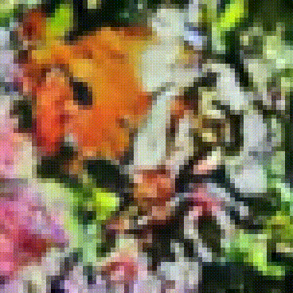

### Tiny Diffusion

[//]: # (![Example]&#40;./sample.gif&#41;)

####
Train a diffusion model from scratch in 2 hours using a basic GPU.
####
Create a latent traversal video (like the above) in 1 minute.
####
Learn the basic implementation of image diffusion and latent traversal using this code.

### Train
1. Download the [Butterfly Dataset](https://www.kaggle.com/datasets/phucthaiv02/butterfly-image-classification) from Kaggle or get any dataset with ~10K RGB images. 
2. Put all images (train and test set) in './data/butterfly/train_and_test/butterfly'
4. Run train.py, this is the training schedule I used:
   - 100 epochs with learning rate = 1e-4 
   - 50 epochs with learning rate = 0.5e-4
   - 50 epochs with learning rate = 0.2e-4 
5. For reaching the accuracy needed to generate samples like the above,  
my model reached a loss = 0.0289 and a clean loss = 0.2288.

### Inference
1. Run inference.py
2. Generated images will appear in './results'

### Hardware
This model was trained from scratch on a single NVIDIA RTX 4060 Ti 16GB in ~2 hours.

### Notes
This code is roughly based on the ddpm paper's method with some simplifications. 
I've used a dataset of 10,000 RGB images with a resolution of 64x64.

### References
- https://arxiv.org/pdf/2006.11239
- https://github.com/milesial/Pytorch-UNet
- https://github.com/tqch/ddpm-torch
- https://www.kaggle.com/datasets/phucthaiv02/butterfly-image-classification 
- https://github.com/facebookresearch/fairseq/blob/main/fairseq/modules/sinusoidal_positional_embedding.py