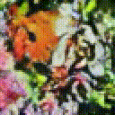

### tiny-diffusion

[//]: # (![Example]&#40;./sample.gif&#41;)

Train a diffusion model from scratch in 2 hours on a basic GPU.  

This project shows a basic implementation of image diffusion and latent traversal. It's roughly based on the ddpm paper. 

### Train
1. Download the [butterfly dataset](https://www.kaggle.com/datasets/phucthaiv02/butterfly-image-classification) from kaggle, or get your own 10k rgb images 
2. Place all images (train and test set) in the same dir
3. Pass the dir to train.py
4. Run train.py, this is the training schedule I used:
   - 100 epochs with learning rate = 1e-4 
   - 50 epochs with learning rate = 0.5e-4
   - 50 epochs with learning rate = 0.2e-4 
5. For reaching the accuracy needed to generate samples like the above, my model reached a loss = 0.0289, and a clean loss = 0.2288.
### Inference
1. Run inference.py
2. See 'results' dir for the generated output images.

### References